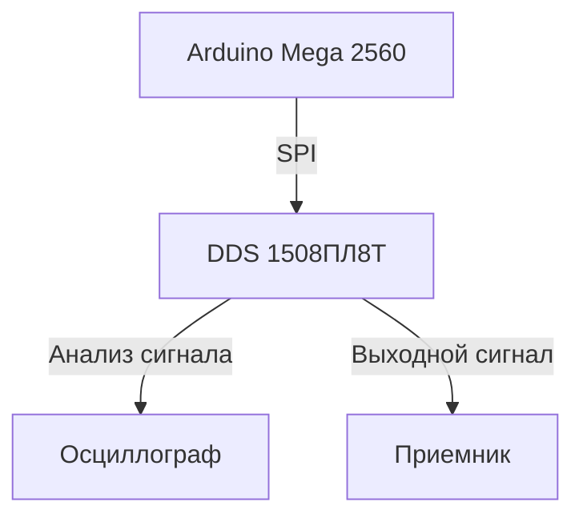

# Управление цифровым вычислительным синтезатором частот 1508ПЛ8Т


## Описание проекта  
Проект разработан для управления цифровым вычислительным синтезатором частот (DDS) 1508ПЛ8Т с использованием микроконтроллера Arduino Mega 2560. 
Система позволяет настраивать частоту, фазу и амплитуду выходного сигнала с высокой точностью через последовательный порт (SPI).  

## Задачи, которые решает проект  
- **Упрощение работы с 1508ПЛ8Т**, благодаря удобной библиотеке команд.  
- **Генерация высокоточных сигналов** с заданной частотой и амплитудой.   
- **Удобная настройка выходных параметров**

## Технические характеристики DDS 1508ПЛ8Т  
- Двухканальный цифровой вычислительный синтезатор (DDS)  
- Частота дискретизации до **1 ГГц**  
- Поддержка модуляций: ЛЧМ, ЧМ, ФМ, QAM  
- Управление через **последовательный интерфейс SPI**  
- Высокая стабильность выходного сигнала  

## Используемые технологии  
- **Язык программирования:** C++  
- **Микроконтроллер:** Arduino Mega 2560  
- **Аппаратное взаимодействие:** SPI  
- **Осциллограф для тестирования сигналов**  

## Подключение DDS 1508ПЛ8Т к Arduino Mega  

| DDS 1508ПЛ8Т | Arduino Mega | Осциллограф |
|--------------|-------------|-------------|
| SDI         | Pin 51      | CH2         |
| SCK         | Pin 52      | CH1         |
| SCSn        | Pin 53      | CH3         |
| GND         | GND         | GND         |

## Схема  



## Пример использования библиотеки  
```cpp
#include "DdsBuilder.h"

// Определение пинов
int dataPin = 51;   // SDI
int clockPin = 52;  // SCK
int csPin = 53;     // SCSn

Dds *dds = DdsBuilder::useSerialController(&_SDI, &_SCS, &_CLK).getDds();

void setup() {
    pinMode(dataPin, OUTPUT);
    pinMode(clockPin, OUTPUT);
    pinMode(csPin, OUTPUT);
    dds->init();
}

void loop() {
    dds->setFreq(300);  // Установка частоты 300 МГц
    dds->setA(1.0);     // Установка амплитуды
    delay(2000);
}
```

## Временная диаграмма передаваемых сигналов и таблица декодирования


Переданнные данные, где сначала передается команда, за ней адрес, после команда записи, после уже информационные 16 бит. Информационными являются 2, 4, 6 – их значения в шестнадцатеричной системе: CCCD CCCC 4CCC

## Тестирование  
- Изменение амплитуды **0.5** от максимального значения и измерение осциллографом.


Установим амплитуду равную половине от максимального значения.  
```
dds->setA(0.5);
```


Получаем -12dBm вместо -24dBm

## Итоги  
В рамках учебного проекта была разработана библиотека для управления DDS 1508ПЛ8Т через интерфейс SPI. Проведены эксперименты, подтверждающие корректность работы системы. Дальнейшее развитие включает **расширение функциональности** и поддержку **дополнительных режимов модуляции**.  
